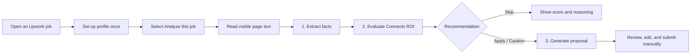
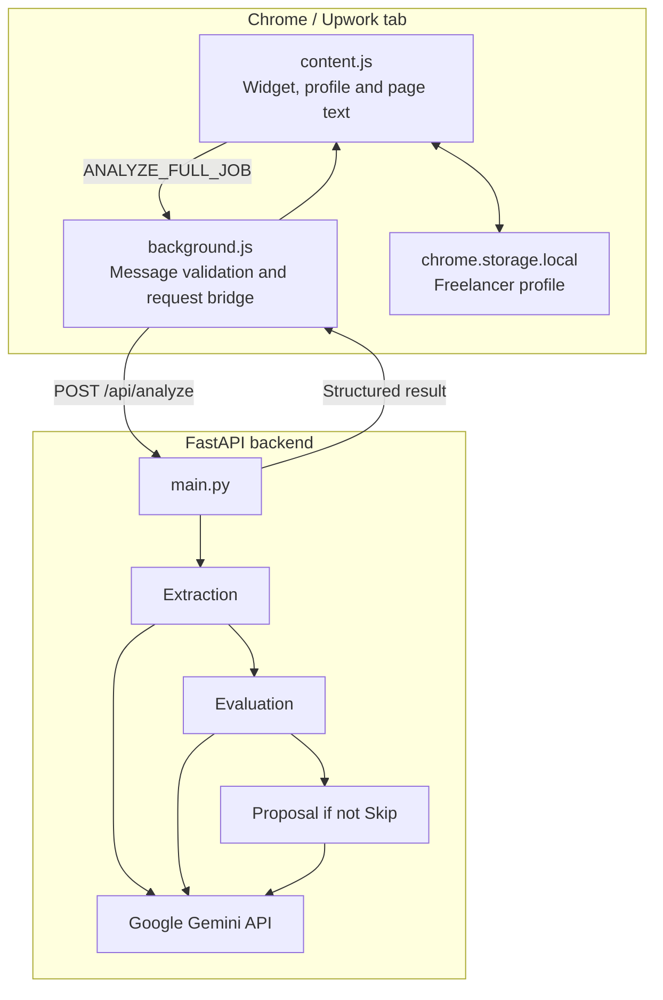

# 🦁 Squad Potohar

> **Comebck Pakistan — Cohort 1 · Product Challenge**

---

# UpTally — Connects Budget Optimizer

> Make a more informed decision before spending Upwork Connects.

**UpTally** is a Chrome extension for Upwork freelancers. It reads the job page a freelancer is actively viewing, evaluates the opportunity for Connects ROI, and presents an **Apply**, **Apply with Caution**, or **Skip** recommendation. For opportunities that are not skipped, it also prepares a tailored proposal draft for the freelancer to review, edit, and submit manually.

Built by **Squad Potohar** for the [Comebck Pakistan Cohort 1 Product Challenge](https://github.com/Comebck-Pakistan/cohort-1-product-challenge).

## Contents

- [The problem](#the-problem)
- [Product flow](#product-flow)
- [Features](#features)
- [Architecture](#architecture)
- [Repository layout](#repository-layout)
- [Install the extension](#install-the-extension)
- [Run the backend locally](#run-the-backend-locally)
- [API reference](#api-reference)
- [Privacy and responsible use](#privacy-and-responsible-use)
- [Research and product documentation](#research-and-product-documentation)
- [Limitations and roadmap](#limitations-and-roadmap)
- [Team](#team)
- [Contributing](#contributing)
- [License](#license)

## The problem

Upwork Connects have a real cost. Freelancers can spend them on jobs that are already crowded, stale, poorly scoped, underpriced, or associated with weak client signals. Manually qualifying each post and writing a relevant proposal also takes time away from better opportunities.

Our research repeatedly surfaced three needs: know whether a job is worth the Connects before applying, move while a client and post are active, and write a specific proposal without generic AI copy. UpTally is decision support for that moment. It does not guarantee an outcome, replace professional judgement, or submit work on a freelancer’s behalf.

## Product flow



The server runs a three-stage Gemini pipeline. Extraction uses only facts explicit in the text. Evaluation produces the decision, 0–100 score, confidence, strengths, risks, and reasoning. Proposal generation is called only when the decision is not `Skip`.

## Features

- **In-page extension UI** on supported Upwork job, Find Work, and job-search routes.
- **One-time freelancer profile**, stored locally with `chrome.storage.local`. Name, experience level, and at least one skill are required; portfolio links and bio are optional.
- **User-initiated analysis**: the extension reads visible `document.body.innerText` only after the freelancer chooses **Analyze this job**. Short or unloaded pages are stopped before an API request.
- **SPA-aware navigation**: a mutation observer resynchronizes the widget as Upwork’s route or selected job changes.
- **Structured job extraction**: title, description, budget, experience level, skills, payment verification, proposal range/count, posting time, hire rate, total spend, and client country when present.
- **Connects ROI assessment**: decision, score, confidence, pros, cons, and concise personalized reasoning. The evaluation framework considers freshness, competition, client quality, budget realism, scope clarity, and the freelancer profile.
- **Conditional proposal drafting**: a personalized proposal and fit explanation are generated only for non-skip decisions.
- **Human-in-control workflow**: UpTally never applies or submits proposals. The freelancer retains final review and action.
- **Resilient handling**: JSON-only model prompts, backend parsing/recovery, loading states, escaped UI output, and actionable error states.

## Architecture



The Manifest V3 service worker accepts messages only from an Upwork page. The Gemini key remains on the backend; it is never embedded in the extension.

## Repository layout

```text
cohort-1-squad-potohar/
├── UpTally_Connects Budget Optimizer/
│   ├── extension/
│   │   ├── manifest.json          # Manifest V3 configuration
│   │   ├── content.js             # UI, profile and results
│   │   ├── background.js          # Service worker / backend bridge
│   │   └── icon/                  # Extension assets
│   └── backend/
│       ├── main.py                # FastAPI endpoint and pipeline
│       ├── models.py              # Request model and scoring framework
│       ├── prompts.py             # Three Gemini prompts
│       ├── services.py            # Gemini integration
│       ├── utils.py               # Input and JSON handling
│       └── requirements.txt
├── extension-prototype/           # Earlier prototype
├── Research/findings-and-insights.md
├── srs.md                         # Product requirements and direction
├── LICENSE
└── README.md
```

## Technology

| Layer | Technology |
| --- | --- |
| Browser extension | JavaScript, Chrome Extensions Manifest V3, content script, service worker, Chrome local storage |
| Backend | Python, FastAPI, Uvicorn, Pydantic |
| AI | Google Gemini via `google-generativeai` (`gemini-3.1-flash-lite`) |
| Configuration | `python-dotenv` and a backend `.env` file |
| Production service | Render-hosted FastAPI endpoint, configured in the extension |

## Install the extension

### Prerequisites

- Chrome or another Chromium browser with extension developer mode
- An Upwork account and an accessible job page
- The deployed analysis service, or a local backend configured in `extension/background.js`

### Load unpacked

1. Clone this repository.

   ```bash
   git clone https://github.com/Comebck-Pakistan/cohort-1-squad-potohar.git
   cd cohort-1-squad-potohar
   ```

2. Open `chrome://extensions`.
3. Enable **Developer mode**.
4. Select **Load unpacked**.
5. Select [`UpTally_Connects Budget Optimizer/extension`](UpTally_Connects%20Budget%20Optimizer/extension).
6. Open an Upwork job or supported Find Work/search route, select a job, and use the UpTally widget.

### First-use workflow

1. Enter name, experience level, and skills; add portfolio URLs and a bio if helpful.
2. Open the job details to assess.
3. Select **Analyze this job**.
4. Review the recommendation and extracted metadata.
5. Edit any returned proposal so it accurately represents you.
6. Submit manually on Upwork only if you decide to proceed.

## Run the backend locally

The extension currently targets its deployed Render URL in [`background.js`](UpTally_Connects%20Budget%20Optimizer/extension/background.js). For local development, replace that URL with your local server URL and add the required local host permission in the manifest. Keep local endpoint changes and API keys out of commits.

```bash
cd "UpTally_Connects Budget Optimizer/backend"
python -m venv .venv
```

Activate the virtual environment:

```powershell
# Windows PowerShell
.\.venv\Scripts\Activate.ps1
```

```bash
# macOS / Linux
source .venv/bin/activate
```

Install dependencies, then create `backend/.env`:

```bash
pip install -r requirements.txt
```

```env
GEMINI_API_KEY=your_google_ai_api_key
```

Start the server:

```bash
uvicorn main:app --reload --host 127.0.0.1 --port 8000
```

Verify it:

```bash
curl http://127.0.0.1:8000/
```

```json
{"status":"awake"}
```

After editing extension files or its manifest, use **Reload** on `chrome://extensions` and refresh the Upwork tab.

## API reference

### `GET /`

Returns the service health state:

```json
{"status":"awake"}
```

### `POST /api/analyze`

Runs extraction, evaluation, and—unless the evaluation is `Skip`—proposal generation.

```json
{
  "pageText": "Visible text from the currently opened Upwork job page",
  "profile": {
    "name": "Ayesha Khan",
    "experienceLevel": "Intermediate, 4 years",
    "skills": ["React", "Python"],
    "portfolio": ["https://example.com"],
    "bio": "Frontend developer focused on product interfaces."
  }
}
```

Successful responses return:

```json
{
  "success": true,
  "data": {
    "profile": {},
    "extraction": {},
    "evaluation": {},
    "proposal": {},
    "proposalError": null
  }
}
```

For a `Skip` decision, `proposal` is `null`. A proposal-generation error does not discard a completed extraction or evaluation.

## Privacy and responsible use

- The extension operates on the job page the user has actively opened; it does not implement background crawling, bulk collection, or automatic applications.
- Analysis starts only after the user selects **Analyze this job**.
- The profile stays in browser-local Chrome storage. When analysis is requested, the visible page text and profile are sent to the configured backend, which calls Gemini.
- Keep `GEMINI_API_KEY` in `backend/.env`. The repository ignores `.env`; never commit it.
- Results are assistance, not a guarantee of job quality, client intent, hiring outcome, or platform-policy compliance.

Use UpTally responsibly and in accordance with Upwork’s applicable terms and policies. The freelancer remains responsible for every proposal and action taken.

## Research and product documentation

- [Research findings and insights](Research/findings-and-insights.md): outreach, interviews, polls, Reddit feedback, and competitor observations.
- [Software Requirements Specification](srs.md): problem framing, personas, requirements, decision-engine direction, and future phases.
- [Prototype README](extension-prototype/README.md): the earlier product and technical iteration.

The SRS captures the intended evolution of the product. The implementation in `UpTally_Connects Budget Optimizer/` is the source of truth for the current release and setup.

## Limitations and roadmap

### Current limitations

- Supported routes are limited to the Upwork paths detected by the content script.
- UpTally relies on visible page text, so layout changes, incomplete loading, or missing information can reduce extraction quality.
- Evaluation is model-generated and should be reviewed critically; it is not a guaranteed forecast.
- There is no automated test suite in this repository at present.
- The current release does not include automatic submission, outcome tracking, account sync, or bulk job processing.

### Future direction

The SRS identifies possible future work: a more deterministic decision engine, richer scoring signals, outcome logging, recalibration from observed outcomes, additional freelance platforms, and team capabilities. These are roadmap items, not claims about the current release.

## Team

**Squad Potohar**

| Member | GitHub |
| --- | --- |
| Muhammad Rafay | [@itsrafay03](https://github.com/itsrafay03) |
| Azhar Soomro | [@Azharaliii](https://github.com/Azharaliii) |
| Anas Khan | [@anasAnonymous](https://github.com/anasAnonymous) |
| Muhammad Eesa Qamar | [@Eesa-cyber](https://github.com/Eesa-cyber) |
| Zaid Haris Saigal | [@Zaidharissheikh](https://github.com/Zaidharissheikh) |

## Contributing

Use a short-lived branch and pull request for each change:

```bash
git checkout main
git pull origin main
git checkout -b your-name/short-description
# make and verify your change
git add .
git commit -m "Briefly describe the change"
git push -u origin your-name/short-description
```

Explain the user-facing impact in the pull request, request a squadmate’s review, and merge after approval. Never commit secrets, `.env` files, virtual environments, or generated caches.

## License

Licensed under the [MIT License](LICENSE). Copyright © 2026 Comebck Pakistan.
